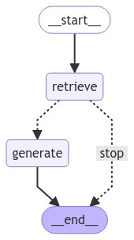
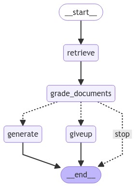
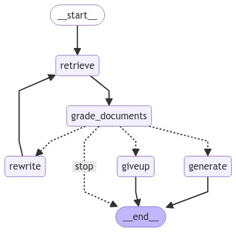

# FreshmanRAG_bot
FreshmanRAG_bot is a Ukrainian Telegram bot designed to assist first-year students by providing answers to frequently asked questions using Retrieval-Augmented Generation (RAG) with a Large Language Model (LLM). Freshmen often have numerous questions, but they tend to ignore pinned messages and guides. This leads to repeated inquiries, making it challenging for volunteers to answer each of them. The bot aims to alleviate this burden by autonomously delivering answers or directing users to relevant links.

## Bot Functionality

### Commands

The bot has two categories of commands: user commands and admin commands. 

Admin commands enable actions like banning users, adding information to the knowledge base, and appending public links to private messages. These can be found in the [management handlers](./bot/handlers/management.py).

User commands are tailored for the students (freshmen) and include:

- **/docs <question>** - Returns documents or facts relevant to the query.
- **/docs_rep** - Retrieves documents or facts relevant to a query from a replied message.
- **/ans <question>** - Provides an answer to a question using RAG.
- **/ans_rep** - Answers a question from a replied message using RAG.
- **/help** - Displays a description of user commands.
- **/start** - Shows a welcome message.

### RAG Pipeline Types

Currently, three distinct RAG pipelines are implemented. By default, the bot uses the **Conditional RAG with Question Rewriting** pipeline. You can change this in the [configuration settings](#configuration). All pipelines support the option to return only documents relevant to a question without generating an LLM answer, depicted as a `stop` edge in all the diagrams below.

#### Simple RAG

The `Simple RAG` pipeline uses a [retriever](#retrievers) to find relevant documents from the knowledge base, optionally utilizing this information for answer generation.



#### Conditional RAG with Document Filtering

This pipeline expands on the `Simple RAG` by adding a step to filter out documents irrelevant to the question. If all documents are filtered out, a message is generated (`giveup` node) indicating no relevant document is available. It currently uses an LLM with a special prompt for document grading, though contributions for encoder-only models for filtering are welcome.



#### Conditional RAG with Question Rewriting

The `Conditional RAG with Question Rewriting` takes a further step if the documents are filtered out. Instead of giving up, it attempts to rephrase the question (within a set limit) and uses the rewritten query for a new search and answering process.



## LLMs

The bot currently uses the Gemma2-2B-it (Q5-K quantized) model as its LLM. This choice stems from limited resources; larger models require hosting on GPU nodes, which is costly. And on CPU even the smallest LLaMa-3.1-8b quantized model takes a minute to run with llama.cpp. That's why Gemma2-2B-it was chosen for its solid performance in the given size and its reasonable understanding of Ukrainian. Future plans include fine-tuning this model for improved Ukrainian comprehension and RAG capabilities, with scripts available in the [llms directory](./llms/).

Optionally, you can configure the bot to use OpenAI models by inputting your `OPENAI_API_KEY` in the .env file and adjusting the LLM configuration.

## Retrievers
We support various retriever types:

- Dense vector retrievers using Sentence BERT model [*lang-uk/ukr-paraphrase-multilingual-mpnet-base*](https://huggingface.co/lang-uk/ukr-paraphrase-multilingual-mpnet-base) with `pgvector` as a storage method.
- Parent document retrievers, which use dense vector retrievers for finding a small relevant document and pass a full parent document as context to an LLM to retain relevant information.
- BM25 Sparse Retriever, utilizing `Elasticsearch` for sparse keyword searches using the BM25 algorithm.
- **Default**: The Ensemble Retriever combines results from the parent document retriever and BM25 retriever using the Reciprocal Rank Fusion algorithm to provide the most relevant information.

## Configuration
To configure the bot I use a reliable and flexible tool called Hydra. In the [configs](./configs/) directory you can find and add your own configs. Please read the [docs](https://hydra.cc/docs/1.3/intro/) to learn how to do it properly. By default (and especially inside a docker container), the bot will load the default config, so in addition to adding new configs, user will also need to modify the [default.yaml](./configs/default.yaml).

The overall structure of the configs is the following:
- llm: language model configuration
- retriever: retriever configuration
- prompts: used to query a language model
- pipeline: RAG pipeline configuration
- knowledge: utilities for loading and pre-processing documents
    - loader: utility for loading documents from given URLs
    - transform: utility for pre-processing documents before uploading to a vector/elasticsearch store

## How to deploy
The easiest way to deploy the bot is to (**target CPU must support all instruction sets that GitHub Actions runner support**):
1. Download a release docker-compose file and optionally required scripts from the [init_scripts](./init_scripts/) directory
```
wget https://raw.githubusercontent.com/ShkalikovOleh/FreshmanRAG_bot/master/docker-compose.release.yml
```
2. Load all desired models (please use scripts from [init_scripts](./init_scripts/)) into the `.models` directory.
3. Place `.env` file with your api keys and other variables (as in the [example.env](./example.env)) in the repo directory
4. Prepare directories for mounting volumes via
```
bash init_scripts/prepare_data_volumes.sh
```
5. Run with docker-compose
```
docker compose -f docker-compose.release.yml up -d
```

Alternatively, you can clone the repo and build docker container on your target machine. Then please use the following command:
```
docker compose -f docker-compose.yml up -d
```
